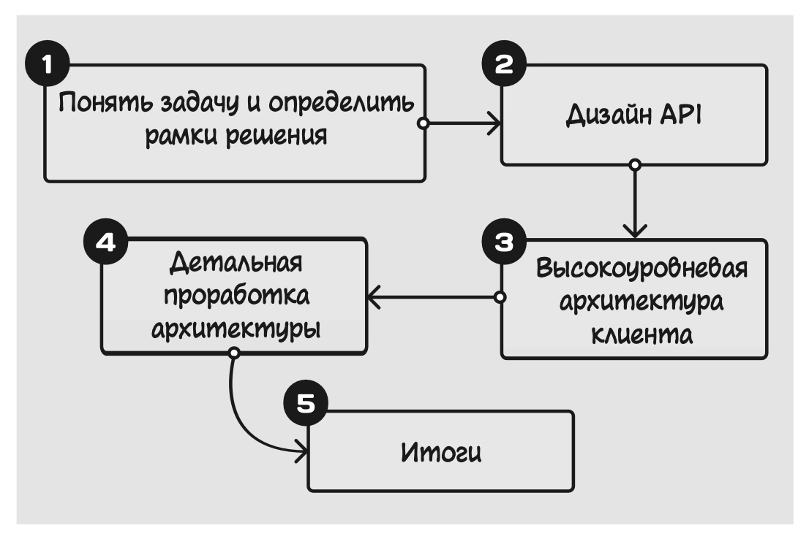

# План собеседования по System Design

> Глава 2 из книги Mobile System Design Interview

Чтобы успешно пройти собеседование по проектированию мобильных систем, необходимо иметь четкую схему (план действий), иначе общение с экспертом станет непоследовательным и создаст трудности обеим сторонам. В отличие от задач по кодингу, которые предлагают соискателям на должность разработчика, задания по проектированию систем могут иметь несколько правильных решений, и это придает особую важность методологической стратегии.

Ниже описан примерный план собеседования, который состоит из пяти этапов, или шагов.

## Шаг 1. Понять задачу и определить рамки решения

Обычно собеседование начинается с предложений типа «Спроектируйте ленту новостей» или же «Спроектируйте библиотеку пагинации». Казалось бы, тут все ясно. Однако на этом критически важном шаге необходимо точно понять, что именно предстоит проектировать.

Ваша задача — при помощи целенаправленных вопросов уточнить начальные условия и желаемый конечный результат, то есть определить масштаб (рамки) решения. Ответы эксперта помогут правильно подобрать нужные технологии и заложат фундамент вашего ответа. В этом смысле каждое собеседование уникально.

Какие же вопросы следует задать? Вот примерный список, с которого можно начать:

* **Что мы проектируем?** Этот вопрос прольет свет на требования к дизайну — функциональные и нефункциональные, а также позволит определить, какие аспекты можно оставить за его рамками. К примеру, можно спросить:
    * Какие функции, экраны и критические пользовательские сценарии[^1] (*critical user journeys, CUJ*) мы проектируем?
    * Нужна ли предварительная загрузка данных? Следует ли предусмотреть аутентификацию пользователей?

* **Для кого мы проектируем?** Этот вопрос поможет понять масштабы и характер применения приложения, а значит — оценить, насколько производительным должно быть предлагаемое решение. К примеру, можно спросить:
    * На какое количество активных пользователей в день мы рассчитываем? Ожидаем ли мы, что их число увеличится?
    * Мы создаем минимально жизнеспособный или же полностью готовый продукт?
    * На какой рынок мы ориентируемся[^2]? Весь мир или какой-то отдельный регион? Каковы типовые сценарии использования? Дома или в поездке?

* **Каковы системные ограничения?** Этот вопрос позволит определить границы системы и правильно выбрать технологии. К примеру, можно спросить:
    * На какие мобильные платформы мы ориентируемся (например, iOS, Android или же и то и другое)?
    * Существуют ли API или системы, с которыми нужно интегрировать будущее приложение?

Во время сбора информации вы заметите, что ответы эксперта раскрывают перед вами и другие аспекты будущей системы. Не бойтесь делать разумные предположения на основе услышанного. Старайтесь формулировать их как можно более четко, чтобы эксперт смог устранить любые недопонимания.

Однако ваша цель не в том, чтобы задать как можно больше вопросов. Делайте акцент на самых насущных проблемах, думайте о том, что важно уточнить, опираясь на здравый смысл и собственное суждение.

> ⚠️ **ПОМНИТЕ:** От полученных ответов зависит, какие технические решения вы примете и на какие компромиссы пойдете. В дальнейшем, когда вы будете объяснять свои действия эксперту, ссылайтесь на его ответы.

## Шаг 2. Дизайн API

При проектировании API[^3] необходимо зафиксировать контракт между клиентским приложением и внешними зависимостями. Этот шаг очень важен, поскольку он позволяет убедиться, что ваше понимание задачи совпадает с ожиданиями интервьюера, и закладывает прочный фундамент для последующей работы.

Проектирование приложения, которое должно взаимодействовать с бэкендом, необходимо начинать с выбора подходящих для конкретного случая протоколов и эндпоинтов[^4]. С другой стороны, при работе над мобильной библиотекой основное внимание следует уделить планированию публичного API, при помощи которого приложения будут сначала инициализировать и настраивать библиотеку, а затем и работать с ней.

Помимо самого API нужно продумать и модели данных, которые будут использоваться. Они должны четко соответствовать структурам данных и взаимосвязям между ними независимо от реализации (JSON-данные, структуры Swift, классы данных Kotlin или же Protocol Buffers для повышения эффективности).

## Шаг 3. Высокоуровневая архитектура клиента

После API наступает очередь высокоуровневой схемы архитектуры клиента, которая показывает взаимосвязи между компонентами приложения.

Она определяет пространство для проектирования, позволяет наглядно судить о соответствии дизайна предъявленным требованиям и — что еще более важно — о соответствии всего потока данных необходимой функциональности системы. При построении схемы архитектуры следует выявить проблемные области, которые требуют дополнительного обсуждения на следующем шаге работы.

## Шаг 4. Детальная проработка архитектуры

На этом шаге, действуя совместно с экспертом, вам предстоит выявить узкие места, а также тщательно проработать некоторые компоненты. В общем случае нужно наметить две-три темы для обсуждения, хотя все зависит от обстоятельств.

Не забывайте обновлять схему архитектуры по результатам диалога. Кроме того, следует прислушиваться к реакции эксперта и его вопросам. Если его интересует несколько тем, старайтесь уделить внимание каждой из них, не выбиваясь при этом за рамки отведенного для собеседования времени.

## Шаг 5. Итоги (необязательно)

Если позволит время, вы можете использовать этот последний шаг, чтобы продемонстрировать способность критически оценить предложенный дизайн и наметить его развитие в будущем. Вот несколько советов, как эффективно подвести итоги собеседования:

* **Обобщите основные решения.** Если во время обсуждения вы сравнивали варианты реализации, оценивая их плюсы и минусы, или же приняли непростые решения, попробуйте подвести краткий итог. Это поможет закрепить основные аспекты дизайна и убедиться в том, что эксперт правильно понял ваши доводы, особенно если вы говорили о технических деталях.
* **Продемонстрируйте навык критического мышления.** Если вас спросят о том, как можно улучшить предложенный вами дизайн, ни в коем случае не говорите, что он идеален и полностью завершен. Попробуйте обсудить возможные пути его развития. Это покажет, что вы обладаете навыками самоанализа и критического мышления — это высоко ценится экспертами.
* **Проанализируйте пограничные случаи.** Воспользуйтесь возможностью для обсуждения потенциальных сбоев и ошибок, которые не были рассмотрены до этого. Так вы покажете, что можете оценивать надежность системы и пользовательский опыт не только при благоприятных, но и при иных условиях.
* **Оцените возможности масштабирования.** Подумайте о том, сможет ли система работать при большем количестве пользователей и развиваться более многочисленной командой разработчиков. Так вы покажете, что думаете о будущем развитии дизайна и понимаете, с какими трудностями — техническими и организационными — можно столкнуться при масштабировании.

## Распределение времени

На собеседовании важно правильно распределить отведенное время. У вас будет всего 45–60 минут и очень много задач, а значит, необходимо следовать четкому плану.

Вот пример тайм-лайна для 45 минут типового собеседования:

1. **Понять задачу и определить рамки решения (5–10 минут).** Не спеша ознакомьтесь с задачей и оцените требования к дизайну.
2. **Дизайн API (5–10 минут).** Подумайте о том, как приложение будет взаимодействовать с сервисами бэкенда, определите основные модели данных.
3. **Проектирование высокоуровневой архитектуры клиента (10–15 минут).** Опишите основные компоненты системы и принципы их взаимодействия.
4. **Детальная проработка архитектуры (15–20 минут).** Сосредоточьтесь на наиболее важных технических трудностях и деталях реализации.
5. **Итоги (0–5 минут).** Обобщите основные решения, обсудите возможные улучшения и компромиссы.

Не забывайте о том, что эти рекомендации — не строгие правила. Будьте готовы подстроиться под ситуацию, особенности поставленной задачи или фокус внимания конкретного интервьюера. Главное — проработать все важные аспекты и полностью завершить работу за отведенное время.

---

[^1]: **Критический пользовательский сценарий (critical user journey)** — ключевая последовательность действий пользователя, ведущая к получению основной ценности продукта. — *Примеч. науч. ред.*
[^2]: В контексте этих вопросов также используется термин **«целевая аудитория» (ЦА)** — группа пользователей, на которых ориентирован продукт и чьи потребности он должен учитывать при проектировании. Например: «На какую целевую аудиторию рассчитан этот продукт?». — *Примеч. науч. ред.*
[^3]: **API (Application Programming Interface)** — интерфейс взаимодействия между программными компонентами, описывающий доступные операции и формат передаваемых данных. — *Примеч. науч. ред.*
[^4]: **Эндпоинт (от англ. «endpoint»)** — элемент API, описывающий конкретную операцию и способ обращения. — *Примеч. науч. ред.*