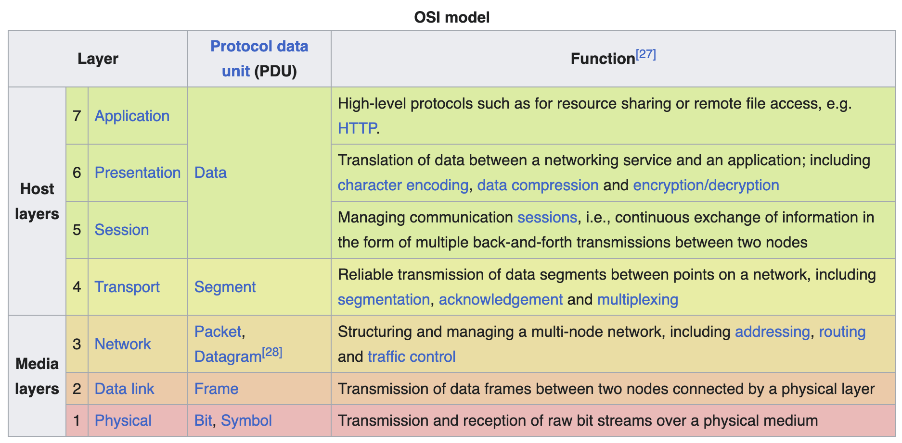

# Расскажи структуру OSI. За что отвечает каждый из слоев и какие протоколы представлены на них?

> Сетевая модель OSI (Open Systems Interconnection) — это концептуальная семиуровневая модель, которая описывает процесс передачи данных в сетях. Каждый уровень выполняет строго определенную задачу, предоставляя сервис вышестоящему уровню и используя ресурсы нижестоящего. Модель делит процесс коммуникации от физического кабеля (Physical) до конечного приложения (Application).

## Разбор

### 1. Физический уровень (Physical Layer)
* Отвечает за передачу потока битов ($`0`$ и $`1`$) по физической среде (кабели, радиоэфир, оптоволокно). Здесь определяются электрические, оптические и механические характеристики интерфейсов
* `Bluetooth`, `DSL`, `USB`

### 2. Канальный уровень (Data Link Layer) 

* Обеспечивает передачу данных между устройствами в одной локальной сети, проверяет ошибки физического уровня и управляет доступом к среде. Делится на два подуровня: LLC (управление логическим каналом) и MAC (управление доступом к среде). На этом уровне работают коммутаторы (switches) и используются MAC-адреса
* `Ethernet`

### 3. Сетевой уровень (Network Layer)

* Отвечает за маршрутизацию данных между различными сетями и определение наилучшего пути. Здесь происходит логическая адресация устройств (IP-адреса). На этом уровне работают маршрутизаторы (routers)
* `IP` (`IPv4`, `IPv6`)

### 4. Транспортный уровень (Transport Layer)

* Обеспечивает сквозную (end-to-end) доставку данных между процессами на хостах. Управляет надежностью передачи, контролем потока и устранением перегрузок. Здесь появляются понятия портов
* `TCP`, `UDP`

### 5. Сеансовый уровень (Session Layer)

Управляет созданием, поддержанием и синхронизацией сессий (сеансов связи) между приложениями. Отвечает за возобновление связи после сбоев и чекпоинты. В современном стеке `TCP/IP` этот уровень часто объединен с прикладным.
* `NetBIOS`, `RPC`, `L2TP`, `PPTP`, `SOCKS`

### 6. Уровень представления (Presentation Layer)

* Отвечает за кодирование, сжатие и шифрование данных, переводя их из формата, используемого приложением, в общесетевой формат (и наоборот). Обеспечивает независимость от представления данных (например, ASCII vs UTF-8)
*  `SSL/TLS` (шифрование), `JSON`, `XML`, `JPEG`, `MPEG`, `MIME`

### 7. Прикладной уровень (Application Layer)

* Верхний уровень, предоставляющий интерфейс взаимодействия между сетевыми службами и пользовательским программным обеспечением (браузеры, почтовые клиенты, Flutter-приложения)
* `HTTP`/`HTTPS`, `FTP`, `SMTP`, `DNS`, `SSH`, `WebSocket`, `gRPC`

## Что почитать

* [OSI model](https://en.wikipedia.org/wiki/OSI_model)
* [Transmission Control Protocol](https://en.wikipedia.org/wiki/Transmission_Control_Protocol)
* [User Datagram Protocol](https://en.wikipedia.org/wiki/User_Datagram_Protocol)
* [Internet Protocol](https://en.wikipedia.org/wiki/Internet_Protocol)
* [HTTP](https://en.wikipedia.org/wiki/HTTP)

