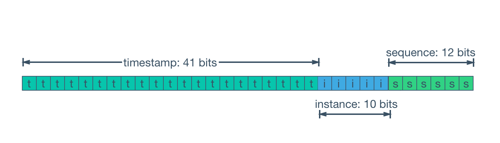

# Что такое Snowflake ID? Сравни с UUID 

> Snowflake ID — это 64-битный уникальный идентификатор, генерируемый в хронологическом порядке (k-sortable) без использования центрального координатора. В отличие от стандартного UUID (128 бит), Snowflake ID занимает в два раза меньше памяти, оптимизирован для эффективной индексации в базах данных (B-Tree) и позволяет извлекать время создания объекта напрямую из самого ID без дополнительных полей.

## Разбор

### Анатомия Snowflake ID



Алгоритм был разработан компанией Twitter для решения проблемы генерации ID в распределенных системах высокой доступности (например, шардированные СУБД вроде Cassandra).  64 бита (соответствующие типу int64 в базах данных или int в Dart) распределяются следующим образом:
- 1 бит: Знаковый бит (всегда равен 0, чтобы число оставалось положительным).
- 41 бит: Временная метка (миллисекунды с начала кастомной эпохи Epoch, а не стандартного Unix Epoch). Этого пространства хватает примерно на 69 лет работы системы. 
- 10 бит: Идентификатор машины/воркера (Worker ID), позволяющий развернуть до 1024 независимых узлов генерации.
- 12 бит: Инкрементный счетчик (Sequence ID). Он сбрасывается в 0 каждую миллисекунду и позволяет генерировать до 4096 уникальных ID на одном узле за одну миллисекунду.

### Сравнение с UUID (Universally Unique Identifier)

| Критерий | Snowflake ID | UUID (v4 / Random) | UUID (v7 / Time-ordered) |
|----------|--------------|--------------------|--------------------------|
| Размер | 64 бита (8 байт) | 128 бит (16 байт) | 128 бит (16 байт) |
| Тип данных | Integer (int64) | Hex-строка / int128 | Hex-строка / int128 | 
| Сортируемость | Да (k-sortable по времени) | Нет (полный рандом) | Да (сортируется по времени) |
| Децентрализация | Требует настройки ID узла | Полная автономность | Полная автономность |
| Влияние на БД | Отлично для B-Tree индексов | Плохо (фрагментация) | Хорошо |

### Ключевые преимущества Snowflake ID перед UUIDv4:

- Эффективность СУБД: Поскольку Snowflake ID монотонно возрастают во времени, при вставке в БД новые строки дописываются в конец B-Tree индекса. UUIDv4 из-за случайности вызывает постоянную перестройку страниц индекса (index page splits), что критически снижает производительность СУБД на запись.
- Экономия Payload: Передача 64-битных чисел по сети и хранение их на мобильном клиенте в локальных БД (Isar, Hive, ObjectBox) гораздо эффективнее работы с тяжелыми 36-символьными строками UUID.

### Риски Snowflake ID:

- Сдвиг системного времени (Clock Drift): Если часы на сервере генерации уйдут назад (например, из-за синхронизации по NTP), алгоритм выдаст ошибку во избежание коллизий.
- Координация узлов: При развертывании новых микросервисов генерации каждому нужно гарантированно выдать уникальный Worker ID (например, через Redis или Consul).


### Пример генератора

```dart
class SnowflakeGenerator {
  final int workerId;
  final int epoch = 1577836800000; // Пример: 2020-01-01 в мс
  
  int _sequence = 0;
  int _lastTimestamp = -1;

  SnowflakeGenerator(this.workerId) : assert(workerId >= 0 && workerId < 1024);

  int nextId() {
    int timestamp = DateTime.now().millisecondsSinceEpoch;

    if (timestamp < _lastTimestamp) {
      throw Exception("Clock moved backwards. Refusing to generate id");
    }

    if (_lastTimestamp == timestamp) {
      _sequence = (_sequence + 1) & 4095;
      if (_sequence == 0) {
        while (timestamp <= _lastTimestamp) {
          timestamp = DateTime.now().millisecondsSinceEpoch;
        }
      }
    } else {
      _sequence = 0;
    }

    _lastTimestamp = timestamp;

    // Сдвиг битов для формирования 64-битного ID
    return ((timestamp - epoch) << 22) | (workerId << 12) | _sequence;
  }
}
```

## Что почитать

* [Understanding Distributed ID Generation with Sonyflake: A Twitter Snowflake Implementation in Go](https://medium.com/@sanhdoan/understanding-distributed-id-generation-with-sonyflake-a-twitter-snowflake-implementation-in-go-e4aab981bfb2)
* [RFC 9562. Universally Unique IDentifiers (UUIDs)](https://www.rfc-editor.org/rfc/rfc9562.html)
* [Wikipedia. Snowflake ID](https://en.wikipedia.org/wiki/Snowflake_ID)
* [Wikipedia. UUID](https://en.wikipedia.org/wiki/Universally_unique_identifier)

