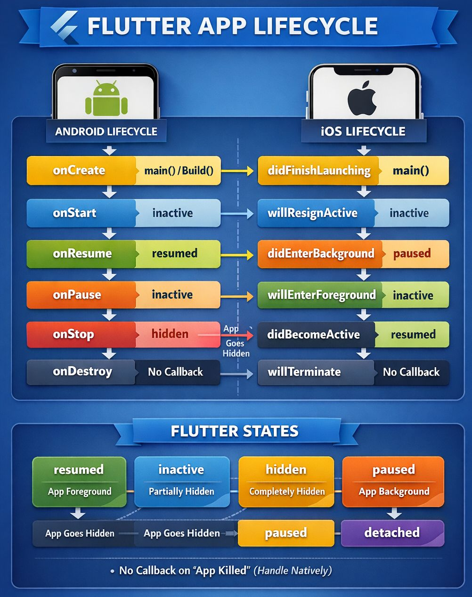

# Как отследить момент, когда пользователь свернул приложение? Чем `inactive` отличается от `paused` на iOS?

> Свернуть/уйти в фон отслеживают через **lifecycle приложения** (`AppLifecycleState`). Обычно используют `WidgetsBindingObserver` или `AppLifecycleListener` и реагируют на переходы в `inactive` / `hidden` / `paused`. На iOS `inactive` — приложение ещё может быть видно, но без фокуса ввода; `paused` — уже не видно пользователю и не обрабатывает ввод.

## Разбор

### Состояния `AppLifecycleState`



| Состояние | Коротко | Практический смысл |
|-----------|---------|--------------------|
| `resumed` | Приложение на экране и интерактивно | Можно продолжать анимации, таймеры, сеть |
| `inactive` | Видно, но без input focus | Звонок, Control Center, App Switcher, overlay |
| `hidden` | UI полностью не виден | Промежуточное/скрытое состояние перед `paused` |
| `paused` | Не видно и не отвечает на ввод | Фон: пауза рендера, остановка тяжёлых задач |
| `detached` | Engine без host view | Старт/завершение, отсоединение view |

Важно: Flutter **не гарантирует** все callback-и (kill из task manager, выдернули питание и т.п.).

### Как отследить «пользователь свернул приложение»

`AppLifecycleListener`:

```dart
class MyApp extends StatefulWidget {
  const MyApp({super.key});

  @override
  State<MyApp> createState() => _MyAppState();
}

class _MyAppState extends State<MyApp> {
  late final AppLifecycleListener _lifecycleListener;

  @override
  void initState() {
    super.initState();
    _lifecycleListener = AppLifecycleListener(
      onResume: () => _onForeground(),
      onInactive: () => _onMaybeBackground(),
      onHide: () => _onBackground(),      // hidden
      onPause: () => _onBackground(),     // paused
      onDetach: () => _onDetached(),
    );
  }

  void _onForeground() {
    // вернулись в приложение
  }

  void _onMaybeBackground() {
    // частично перекрыто / потеря фокуса
  }

  void _onBackground() {
    // свернули или ушли в фон: пауза видео, таймеров, polling
  }

  void _onDetached() {}

  @override
  void dispose() {
    _lifecycleListener.dispose();
    super.dispose();
  }

  @override
  Widget build(BuildContext context) => const MaterialApp(home: HomePage());
}
```

`WidgetsBindingObserver`:

```dart
class HomePage extends StatefulWidget {
  const HomePage({super.key});

  @override
  State<HomePage> createState() => _HomePageState();
}

class _HomePageState extends State<HomePage> with WidgetsBindingObserver {
  @override
  void initState() {
    super.initState();
    WidgetsBinding.instance.addObserver(this);
  }

  @override
  void dispose() {
    WidgetsBinding.instance.removeObserver(this);
    super.dispose();
  }

  @override
  void didChangeAppLifecycleState(AppLifecycleState state) {
    switch (state) {
      case AppLifecycleState.resumed:
        // foreground
        break;
      case AppLifecycleState.inactive:
        // overlay / потеря фокуса
        break;
      case AppLifecycleState.hidden:
      case AppLifecycleState.paused:
        // фон: остановить дорогие операции
        break;
      case AppLifecycleState.detached:
        break;
    }
  }

  @override
  Widget build(BuildContext context) => const Scaffold(body: Text('Home'));
}
```

Практика: для «свернули» обычно реагируют на `hidden` и/или `paused`, а не только на `inactive`.

### `inactive` vs `paused` на iOS

**`inactive` (iOS):**
- приложение в **foreground inactive**;
- UI может быть ещё виден;
- ввод не обрабатывается;
- примеры: входящий звонок, Face ID/Touch ID, Control Center, App Switcher, переход между экранами, открытая шторка уведомлений поверх приложения.

**`paused` (iOS):**
- приложение **не видно** пользователю;
- не отвечает на input;
- движок не вызывает `onBeginFrame` / `onDrawFrame`;
- типичный кейс: ушли на Home / в другое приложение.

Упрощённо:
- `inactive` = «перекрыли или отняли фокус, но ещё не обязательно в фоне»;
- `paused` = «приложение реально в фоне».

На Android названия Flutter-состояний тоже не 1:1 с `onPause`/`onStop`, поэтому ориентируются на Flutter enum, а не только на native callback-и.

### Что делать при уходе в фон

- паузить видео/аудио, анимации, GPS, polling;
- отменять/замораживать таймеры и подписки, если не нужны в фоне;
- сохранять критичное состояние заранее (persist), потому что kill может прийти без callback.

### Частые ошибки

1. Реагировать только на `inactive` и считать, что приложение уже в фоне.
2. Игнорировать `hidden` в `switch` (добавлен в Flutter 3.13).
3. Ожидать callback при жёстком kill процесса (task manager, reboot).

## Что почитать

* [AppLifecycleState enum (Flutter API)](https://api.flutter.dev/flutter/dart-ui/AppLifecycleState.html)
* [WidgetsBindingObserver class (Flutter API)](https://api.flutter.dev/flutter/widgets/WidgetsBindingObserver-class.html)
* [Migration guide for AppLifecycleState.hidden](https://docs.flutter.dev/release/breaking-changes/add-applifecyclestate-hidden)
* [AppLifecycleListener vs WidgetsBindingObserver](https://stackoverflow.com/questions/79463717/applifecyclelistener-vs-widgetsbindingobserver)
* [Flutter App Lifecycle: a comprehensive guide](https://fluttery.medium.com/flutter-app-lifecycle-a-comprehensive-guide-for-beginners-77a639665905)
* [Flutter App Lifecycle states overview (LinkedIn)](https://www.linkedin.com/posts/ali-hamza-gulzar-892b98174_flutter-flutterdev-mobiledevelopment-activity-7407494846296440832-l035)
