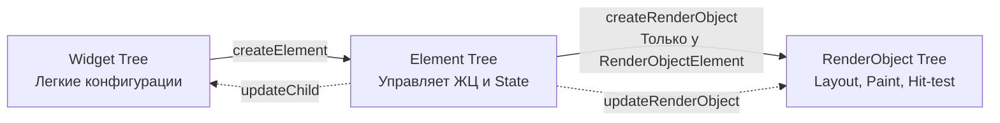

# Объясни связь между Widget Tree, Element Tree и RenderObject Tree. Зачем Flutter использует именно три дерева?

> **Widget Tree** — это неизменяемое описание интерфейса (чертеж). **Element Tree** — это связующее звено (экземпляры виджетов), управляющее жизненным циклом и состоянием. **RenderObject Tree** отвечает за математику (layout, paint, hit-testing). Разделение позволяет Flutter достигать 60/120 FPS: пересоздание легковесных иммутабельных виджетов обходится дешево, а тяжеловесные элементы и рендер-объекты (RenderObjects) переиспользуются через алгоритм согласования (reconciliation).

## Разбор

### Зачем нужны три дерева? (Детально)

Создание, расчет размеров (Layout) и отрисовка (Paint) UI — крайне затратные операции. Если бы при каждом `setState` Flutter перерисовывал весь экран с нуля, это привело бы к падению производительности. 

1. **Widget Tree (Дерево Виджетов)**
   * Это легковесные, **иммутабельные** конфигурации. У них нет мутабельного состояния (даже у `StatefulWidget` состояние хранится отдельно в объекте `State`).
   * Пересоздаются постоянно (десятки раз в секунду во время анимации).
   * Содержат метод `build()` (у `StatelessWidget`) или `createElement()`.

2. **Element Tree (Дерево Элементов)**
   * Представляют конкретный виджет в определенном месте дерева. Это логический "каркас" приложения.
   * **Мутабельны**. Именно `Element` (точнее `StatefulElement`) держит ссылку на объект `State`.
   * **Управление жизненным циклом:** Когда приходит новый Widget, Элемент вызывает `Widget.canUpdate(oldWidget, newWidget)` (сравнивая `runtimeType` и `key`). 
     * Если `true` — Элемент обновляет ссылку на новый виджет и просит `RenderObject` обновиться.
     * Если `false` — Элемент демонтируется (`unmount`), уничтожая старый `RenderObject`, и создается новый.
   * Делятся на два основных типа:
     * **ComponentElement** (не рисуют сами по себе, а состоят из других виджетов — `StatelessElement`, `StatefulElement`).
     * **RenderObjectElement** (напрямую связаны с узлом из дерева RenderObject, например, `Padding`, `Column`, `ColoredBox`).

3. **RenderObject Tree (Дерево Рендер-объектов)**
   * "Тяжеловесы", которые выполняют реальную работу. 
   * Отвечают за протокол компоновки (`performLayout`), отрисовку (`paint(PaintingContext context, Offset offset)`), обработку касаний (`hitTest`).
   * Обновляются точечно благодаря мутабельности. Движок (`PipelineOwner`) проходит по дереву и обновляет только те узлы, которые были помечены как "грязные" (`markNeedsLayout`, `markNeedsPaint`).

### Схема работы под капотом

### Процесс обновления кадра (Frame Pipeline)

Когда вы вызываете `setState`:
1. Элемент помечается как `dirty` (грязный).
2. Управленец `BuildOwner` перестраивает "грязные" элементы.
3. Элемент вызывает `build()` у виджета и получает новое поддерево виджетов.
4. Выполняется согласование (reconciliation) старых и новых элементов дерева.
5. Если конфигурация изменилась, Элементы обновляют свойства соответствующих `RenderObject` (например, меняют цвет).
6. Если новые свойства повлияли на размер, вызывается `markNeedsLayout`. Если только на внешний вид — `markNeedsPaint`.
7. `PipelineOwner` дает команду на перерасчет размеров и отрисовку обновленных узлов дерева `RenderObject` в движок (Skia / Impeller).

## Что почитать

* [Inside Flutter (официальная документация)](https://docs.flutter.dev/resources/inside-flutter)
* [Flutter architectural overview](https://docs.flutter.dev/resources/architectural-overview)
* [The Mahogany Staircase - Flutter's Layered Design](https://www.youtube.com/watch?v=dkyY9WCGMi0)
